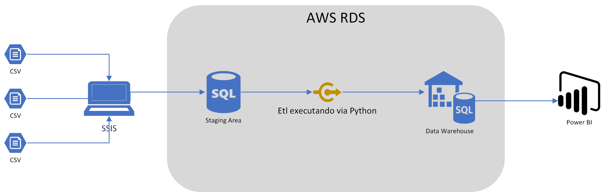
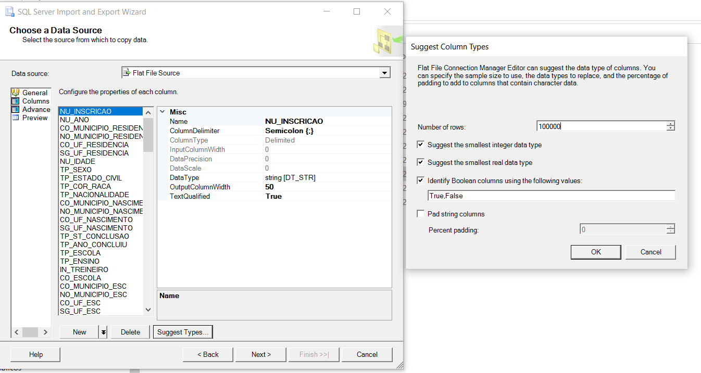
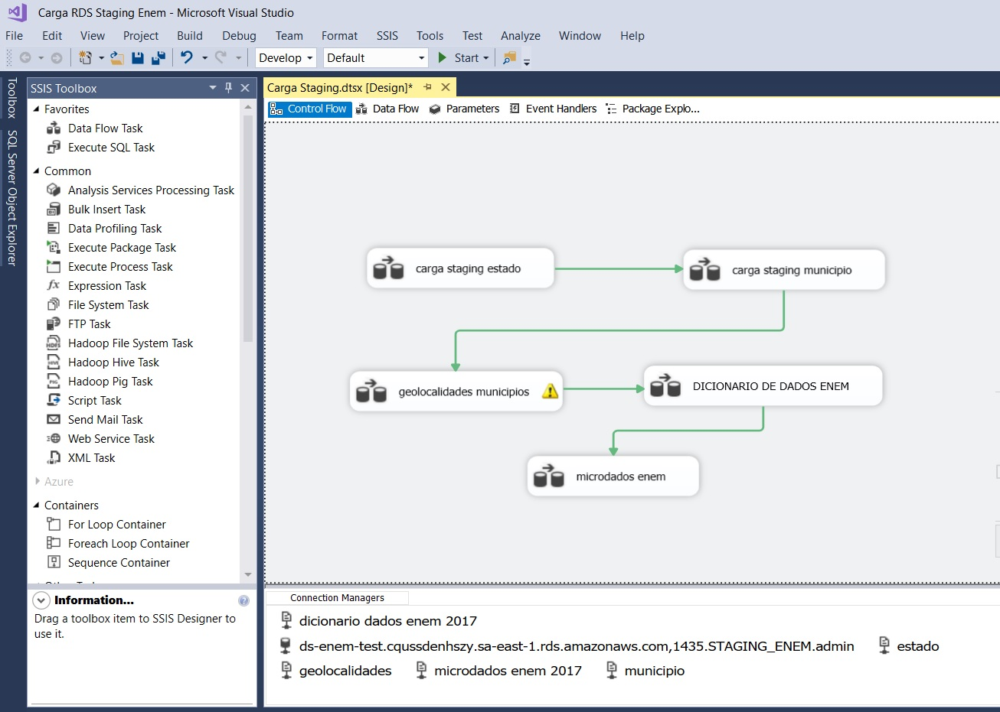
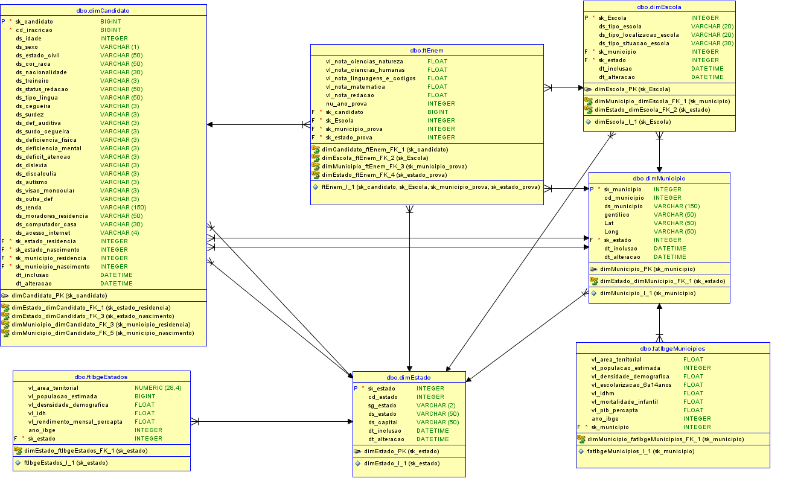
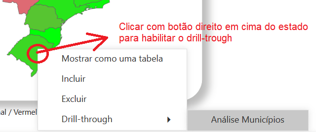

# enemproject
Projeto DataSprints Enem 2017

Com base nos arquivos enviados no teste técnico, foi desenhada a seguinte arquitetura para execução do projeto:

Foi criado no RDS um banco de dados chamado STAGING_AREA 

O script de criação das tabelas deste banco encontra-se aqui [SQL Staging](https://github.com/gabriel88alen88/enemproject/blob/master/Cria%C3%A7%C3%A3o%20tabelas%20database%20Staging_Enem.sql)

Para a tabela MICRODADOS_ENEM_2017 eu utilizei uma feature do SQL para sugerir a forma mais otimizada possível para criar cada campo, além de acompanhar também o arquivo de dicionário de dados no link do desafio.

Segue print da feature do SQL que me mostra como fiz um estudo de análise para carregar as informações da forma mais otimizada possível:

O arquivo de coordenadas estava em formato .mdb , foi convertido para csv e carregado para a tabela BR_Localidades_2010_v1 na staging area. 
O arquivo dicionario_microdados_enem_2017.xls foi convertido para csv para ser utilizado como um "dicionário de dados auxiliar" na execução do ETL. Para isso, esses dados foram armazenados na tabela DICIONARIO_DADOS_ENEM_2017 na staging area.
O arquivo "Cities Data" do desafio não funcionou. Para resolver fui até o site do IBGE e baixei uma database csv para Estados e Municípios.

Os arquivos CSV foram carregados da minha máquina local para o RDS através do Visual Studio (SQL SERVER INTEGRATION SERVICES 2017):

Após a carga na Staging Area, criei a modelagem de dados dimensional no modelo Snow Flake:

Foi criado o banco DW_ENEM no RDS e o script para criação das tabelas encontra-se aqui [SQL DW](https://github.com/gabriel88alen88/enemproject/blob/master/CreateTableDw.sql)

[Dicionario de dados do DW](DW_DICIONARIO.csv)

Foi criada uma procedure SQL para realizar todo ETL.
Utilizei como estratégia de carga para este projeto o truncate das tabelas sempre que for executado pois tratam-se de dados estaticos que dificilmente terão alguma alteração. 
Coloquei um controle de tempo para carga na tabela STAGING_ENEM.DBO.CONTROLE_ETL para controlar o tempo de execução do ETL.
O tempo de execução da carga de todo DW levou 20 minutos, o que considerei aceitável para a estratégia de truncamento de dados para reprocessamento sempre que necessário.

A procedure foi executada via comando [Python](phytonetl.py) 

[SQL da Procedure](ProcedureETL.sql)

Foi criado o dashboard com as análises propostas do desafio e alguns itens a mais. Caso necessário, podemos agendar uma apresentação do dashboard para explicação de todos os pontos e análises feitas por mim para desenvolver este storytelling. 

**_Observação importante :  Na página "Análise por estado, existe o recurso Drill-trough para fazer um drill de estados para municípios. Para usar o drill-trough basta clicar em cima do estado (nome ou mapa) com o botão direito e selecionar Drill-trough -> Análise Municípios _**  

[Segue link para visualização do Dashboard](https://app.powerbi.com/view?r=eyJrIjoiZTAwOTA4NTktYWEzOS00Mjk0LTg0MTAtMjE1MmQxYmRkODEzIiwidCI6IjE0MjY1MzNiLWMwNGEtNDJjOC1iNzZlLWYwZjNlN2JlMTEyMyJ9)

