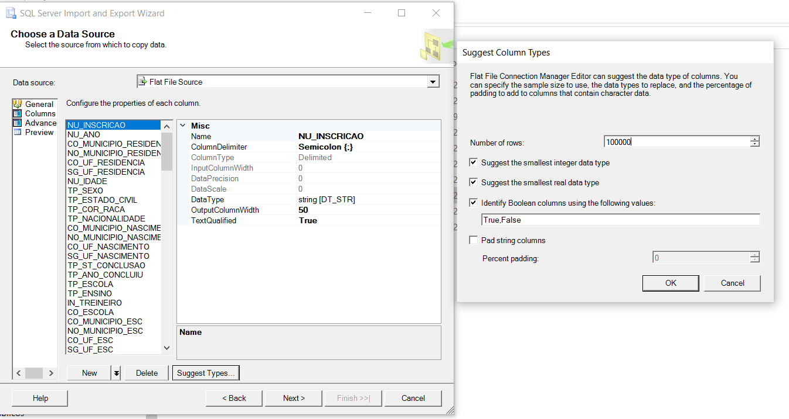

# enemproject
Projeto DataSprints Enem 2017

Com base nos arquivos enviados no teste técnico, foi desenhada a seguinte arquitetura para execução do projeto:

Foi criado no RDS um banco de dados chamado STAGING_AREA 

O script de criação das tabelas deste banco encontra-se aqui [SQL Staging](https://github.com/gabriel88alen88/enemproject/blob/master/Cria%C3%A7%C3%A3o%20tabelas%20database%20Staging_Enem.sql)

Para a tabela MICRODADOS_ENEM_2017 eu utilizei uma feature do SQL para sugerir a forma mais otimizada possível para criar cada campo, além de acompanhar também o arquivo de dicionário de dados no link do desafio.

Segue print da feature do SQL que me mostra como fiz um estudo de análise para carregar as informações da forma mais otimizada possível:

